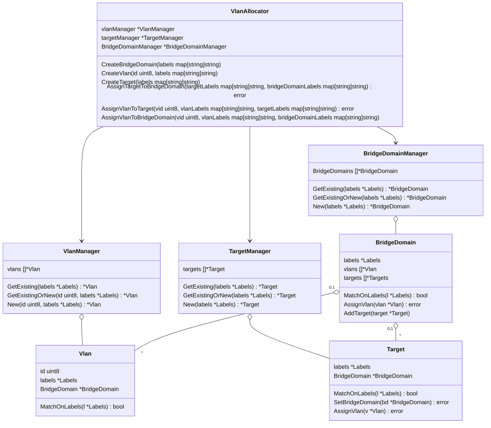

# Overview

```mermaid

classDiagram
    direction TB
    VlanAllocator --> BridgeDomainManager 
    VlanAllocator --> TargetManager
    VlanAllocator --> VlanManager

    
    TargetManager o-- Target
    VlanManager o-- Vlan
    BridgeDomainManager o-- BridgeDomain

    BridgeDomain "0,1" o-- "*" Vlan
    BridgeDomain "0,1" o-- "*" Target


    class VlanAllocator {
        vlanManager *VlanManager
        targetManager *TargetManager
        BridgeDomainManager *BridgeDomainManager

        CreateBridgeDomain(labels map[string]string)
        CreateVlan(id uint8, labels map[string]string)
        CreateTarget(labels map[string]string)
        AssignTargetToBridgeDomain(targetLabels map[string]string, bridgeDomainLabels map[string]string) error
        AssignVlanToTarget(vid uint8, vlanLabels map[string]string, targetLabels map[string]string) error
        AssignVlanToBridgeDomain(vid uint8, vlanLabels map[string]string, bridgeDomainLabels map[string]string)
    }


    class BridgeDomainManager{
        BridgeDomains []*BridgeDomain

        GetExisting(labels *Labels) *BridgeDomain
        GetExistingOrNew(labels *Labels) *BridgeDomain
        New(labels *Labels) *BridgeDomain
    }
    class TargetManager {
        targets []*Target

        GetExisting(labels *Labels) *Target
        GetExistingOrNew(labels *Labels) *Target
        New(labels *Labels) *Target
    }
    class VlanManager {
        vlans []*Vlan

        GetExisting(labels *Labels) *Vlan
        GetExistingOrNew(id uint8, labels *Labels) *Vlan
        New(id uint8, labels *Labels) *Vlan

    }

    class BridgeDomain{
        labels *Labels
        vlans   []*Vlan
        targets []*Targets

        MatchOnLabels(l *Labels) bool
        AssignVlan(vlan *Vlan) error
        AddTarget(target *Target)
    }

    class Target {
        labels *Labels
        BridgeDomain *BridgeDomain

        MatchOnLabels(l *Labels) bool
        SetBridgeDomain(bd *BridgeDomain) error
        AssignVlan(v *Vlan) error
    }
    class Vlan{
        id uint8
        labels *Labels
        BridgeDomain *BridgeDomain

        MatchOnLabels(l *Labels) bool
    }


```